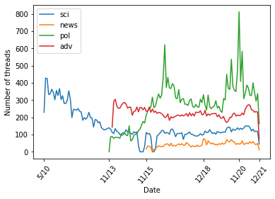
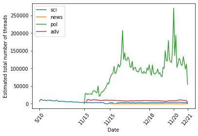

# 4chanAnalysis

This repostory contains the code and data used for a project on a seminar in Computational Social Science at TUM. We implemented tools to obtain data from 4chan archives and analyse the growth of extremist ideologies on the site.

Group members: Benedikt Geitner, Vincent Halasz (@ga42quy), Irene López Gutiérrez (@irenelopez42).

## Data collection

We collect data from two of the most extensive 4chan archives: [4plebs](https://4plebs.org/) and [Archived.moe](https://archived.moe/). We chose 4plebs because of its easily accesible API and the fact that it is (one of) the earliest 4chan archive(s). However, some of the boards we identified as relevant to our project are not archived here. Thus, we extended our dataset by performing some web-scrapping on Archived.Moe.

In total we have collected:

|  Board  |  # threads   |  # posts   |    Since   |
|---------|:------------:|:----------:|-----------:|
|   pol   |    26897     |  1059402   |  Nov 2013  |
|   adv   |    21641     |   294037   |  Jan 2014  |
|   sci   |    20860     |   404025   |  May 2010  |
|   news  |     3156     |    97055   |  Nov 2015  |

For all boards we collected data until December 2021.

### Data format

Threads collected are stored in json files under `/Data/board/`. There are two types of json files:

- `dict_list.json` files contain a dictionary of thread IDs, stored under the keys for the relevant month and year. For example:

~~~
{"2020": {"Jan": [1,2,3], "Feb": [4,5,6]}, "2021": {"Jan": [7,8,9], "Feb": [10,11,12]}}
~~~

- `year####.json` files contain keys for each thread ID in that year. Each ID has an associated dictionary with two keys: "op" and "replies".
    - Under "op" the following information about the original post is stored: the timestamp (in Unix time), the title, and the comment itself (a.k.a the main text block of the post). 
    - Under "replies" there is a list containing the text of all replies to OP. Only the text is stored for these. If a reply only contained an image, it is stored as `None`.

### Sampling

Due to technical limitations it is not feasible for us to collect all available threads. Given that our project is highly focused on analysing patterns as a function of time, we want our data to be representative of the site's activity through time. To achieve this, we collect the data starting from the most recent post and going backwards in time, collecting 1 thread for every X avaible —X being a board dependent variable. The table below shows the percentage of the total archived threads that we collected.

|  Board  |  % collected   |
|---------|:--------------:|
|   pol   |   ~ 0.3 %      |
|   adv   |   ~ 2.5 %      |
|   sci   |   ~ 3.5 %      |
|   news  |    ~ 10 %      |

When plotting data it is possible to rescale the y-axis for each board according to these percentages. This way the scales of the boards relative to one another will be preserved. As an example, the plots below show the number of threads per board as a function of the month when they were posted. The left-hand side plot shows the collected threads, while the data from the right-hand side plot has been scaled appropriately to estimate the actual numbers in 4chan.

 

